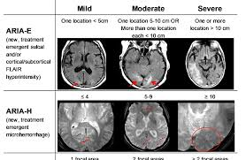

# Video Links
- [Kinsunla vs. Lequembi](https://www.youtube.com/watch?v=Imif-u-YrJY&t=1s)
- [MoCa](https://www.drlizgeriatrics.com/wp-content/uploads/moca-test-english-7-1dragged.pdf)

# 🐰 Alzheimer’s Disease Infusions

💗 **Goal:** Help trainees understand how these therapies are used in practice and what must be checked at every visit.

---

## 🧠 What are AD infusions?
AD infusions are **IV anti-amyloid monoclonal antibodies** intended to reduce amyloid plaque burden in the brain.

They are:
- Used in **MCI due to AD**
- Administered on a **regular infusion schedule**
- Closely monitored due to potential adverse effects

---

## 💉 Common Therapies
Examples you may see that we use in clinic:
- Lecanemab
- Kisunla/donanemab-azbt

---

## 📋 What to Check Every Visit
- Current **infusion number**
  - Either the patient will know OR
  - Please ask staff to contact PA Money on what infusion the patient is currently on
- Last infusion date
- Any missed or delayed doses
- Recent **MRI results**
- New neurologic symptoms
- Anticoagulant or antiplatelet use

---

## ⚠️ ARIA (Amyloid-Related Imaging Abnormalities)

### ARIA-E (Edema)
- Cerebral edema
- May be asymptomatic or symptomatic

### ARIA-H (Hemorrhage)
- Microhemorrhages or superficial siderosis
- Increased risk with anticoagulation

💗 **Always ask about:** headaches, confusion, dizziness, visual changes, nausea, gait changes, or focal neurologic symptoms.

---

## 🧠 MRI Monitoring
- MRIs are performed at **scheduled intervals**
- Imaging determines whether infusions continue, pause, or stop
- MRI findings may guide dose or schedule changes

---

## 📝 Documentation Tips
Include:
- Infusion number and tolerance
- MRI date and impression
- Presence or absence of ARIA symptoms
- Any ED visits or hospitalizations
- Counseling provided

---

## 🧩 Assessment & Plan Language
Example:
> Today we plan to continue AD infusion therapy pending MRI review and absence of ARIA symptoms.

Include follow-up timing and safety instructions.

---

## 👥 Patient & Caregiver Counseling
Key points:
- Not a cure
- Intended to slow disease progression
- Safety monitoring is essential
- New neurologic symptoms should prompt immediate contact

---

## 🐰 Key Takeaways

💗 Safety and monitoring matter more than speed.

- Know the infusion number
- Ask ARIA questions every visit
- Document MRI status
- Involve caregivers

🐾 When unsure, escalate questions—infusion safety comes first.

